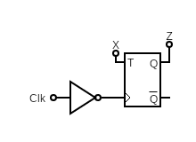
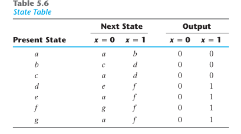
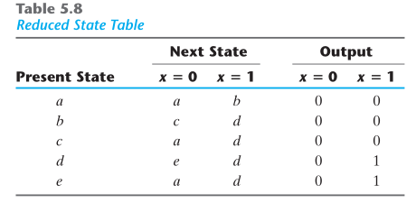
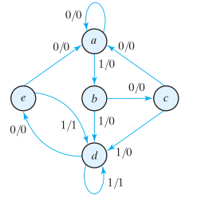

This is going to be wild!

# Question 1:
## Part A:
Design a combinational circuit that counts the Numbers of 1's in 7-bit
($I_0$ $I_1$, ... $I_6$.)
input and has 3-bit output. ($O_0$, $O_1$, $O_3$).
And write the input equations.


TODO!


## Part B:
Design a 5-bit comparator that takes 2's compelemnt. you can use
comparators, adders, decoders, etc.

# Question 2:

## Part A:
What is the function of this circuit?


Toggles every negative edge as long as `X` is 1


## Part B:
Reduce the state table (from the book)





## Part C:
Draw the reduced state diagram of the table



## Part D:
Implement it using T-Flip Flops
<!-- TODO -->

# Question 3:
<!--  -->
## Part  A:
Given the current state is `100`. What is thestate for the next 7 cycles?

## Part  B:
Convert the following `D`-FF serial adder to a `T`-FF:

## Part  C:
Given that all the registers are set to `1011`, what is the value of
register `A` after: `4`, `8` and `12` cycles.

## Part D:
Given the following truth table,

| x | y | z | A | B | C | D |
|:-:|:-:|:-:|:-:|:-:|:-:|:-:|
| 0 | 0 | 0 |   |   |   |   |
| 0 | 0 | 1 |   |   |   |   |
| 0 | 1 | 0 |   |   |   |   |
| 0 | 1 | 1 |   |   |   |   |
| 1 | 0 | 0 |   |   |   |   |
| 1 | 0 | 1 |   |   |   |   |
| 1 | 1 | 0 |   |   |   |   |
| 1 | 1 | 1 |   |   |   |   |

hi
dd

implement it using the following `PAL`.
