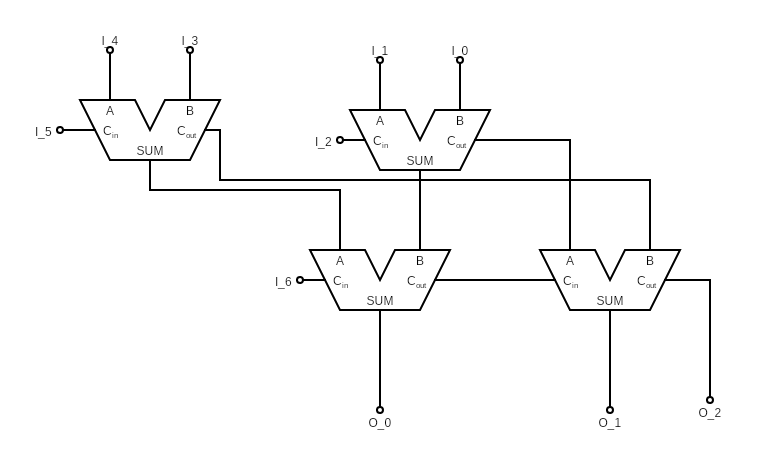

This is going to be wild!

# Question 1:
## Part A:
Design a combinational circuit that counts the Numbers of 1's in 7-bit
($I_0$ $I_1$, ... $I_6$.)
input and has 3-bit output. ($O_0$, $O_1$, $O_3$).
And write the input equations.


Execuse the messy wiring!  

$$O_0 = I_0 \oplus I_1 \oplus I_2 ... \oplus I_7 $$
$$O_1 = $$ left as an exercise to the reader
$$O_3 = $$ left as an exercise to the reader


## Part B:
Design a 5-bit comparator that takes 2's compelemnt. you can use
comparators, adders, decoders, etc.

# Question 2:

## Part A:
What is the function of this circuit?


Toggles every negative edge as long as `X` is 1


## Part B:
Reduce the state table (from the book)





## Part C:
Draw the reduced state diagram of the table



## Part D:
Implement it using T-Flip Flops


This is left as an exercise to the reader.


# Question 3:

(Left is A, Middle is B, Right is C)
## Part  A:
Given the current state is `ABC = 100`. What is the state for the next 7 cycles?


$$ A(t+1) = B \oplus C $$
$$ B(t+1) = A $$
$$ C(t+1) = C $$
$$ ABC(0) = 100 $$
$$ ABC(1) = 010 $$
$$ ABC(2) = 101 $$
$$ ABC(3) = 110 $$
$$ ABC(4) = 111 $$
$$ ABC(5) = 011 $$
$$ ABC(6) = 001 $$
$$ ABC(7) = 100 $$


## Part  B:
Convert the following `D`-FF serial adder to a `T`-FF:


 Easy Solution: Convert the T-FlipFlop back to a D-FlipFlop! (i.e,
 implement a D-FlipFlop with a T-Flipflop)  
 Standard Solution: do the truth table, K-maps, equations, etc.  
 This is left as an exercise to the reader.


## Part  C:
Given that all the registers are set to `1011`, what is the value of
register `A` after: `4`, `8`, `12` and `16` cycles. Initially, the Flip was
set to 0, (or Reset).

Also, Register B is always filled with `1011` every `4` cycles! I am just too lazy to
draw that :)


We can see that after `4` cycles, $A(t+4)=A + B + C $  
We can also see the $C=$ carry of A's sum  
*Initially*
$$ A (0) = 0 $$
$$ C (0) = 0 $$
*After 4 cycles:*
$$ A (4) = 1011 + 1011 + 0 =  0110 $$
$$ C (4) = 1$$

*After 8 cycles:*
$$ A (8) = 0110 + 1011 + 1 =  0010 $$
$$ C (8) = 1$$

*After 12 cycles:*
$$ A (12) = 0010 + 1011 + 1 =  0010 $$
$$ C (12) = 1$$

*After 16 cycles:*
$$ A (16) = 0110 + 1011 + 1 =  1110 $$
$$ C (16) = 0$$



## Part D:
Given the following truth table,

| x | y | z | A | B | C | D |
|:-:|:-:|:-:|:-:|:-:|:-:|:-:|
| 0 | 0 | 0 | 1 | 1 | 0 | 0 |
| 0 | 0 | 1 | 0 | 0 | 1 | 1 |
| 0 | 1 | 0 | 1 | 0 | 0 | 1 |
| 0 | 1 | 1 | 1 | 1 | 1 | 1 |
| 1 | 0 | 0 | 1 | 0 | 1 | 1 |
| 1 | 0 | 1 | 1 | 1 | 0 | 1 |
| 1 | 1 | 0 | 1 | 1 | 1 | 0 |
| 1 | 1 | 1 | 0 | 0 | 0 | 1 |

implement it using the following `PAL` after filling the table.


Do the K-maps, then you get:  
$$ A = \bar{z} + x \oplus y $$
$$ B = \overline{x \oplus y \oplus z} $$
$$ C = x \oplus z$$
$$ D = z + x \oplus y $$



$B$ can be simplifed as
$$ B = \overline{y \oplus C } $$
Which can be furthur simplified as
$$ B = \bar{y} \oplus C $$

Also if you are wondering how tf $\oplus$ and $\bar{\oplus}$ are
implemented using AND and OR gates, refer to the book.




This is left as exercise to the reader.





