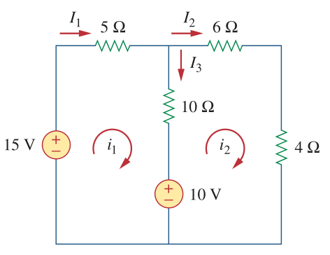
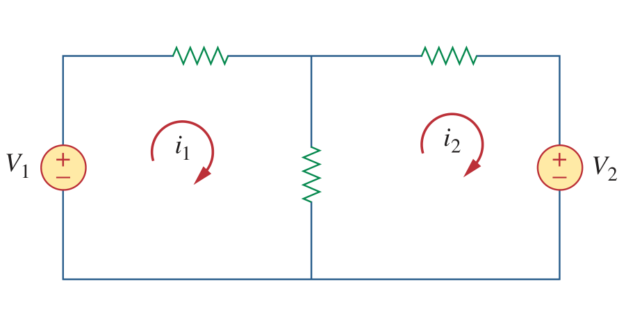

# tl;dr
The lecture introduced the matrix notation for KVL

# Basics
As we already know from *Circuit I*, applying KVL's law to a mesh is
given by the equation:

$$
\sum{v} = 0
$$

Which can be expanded further, using ohm's law $V=IR$.

$$
\sum{R_S I_S} -
\sum{R_m I_m} =
\sum{V_s}
$$

Where $R_S$ and $I_S$ are the resistance and currents in the mesh,
$R_m$ and $I_m$ are the resistance and currents in the mesh that are
shared between other meshs, and $v_S$ is is the source voltage (more
on polarity later).

For example, 

We can simplfy find the mesh equation for $i_1$ as follows

$$
\sum{R_S I_S} = (5+10)i_1
$$
$$
\sum{R_m I_m} = 10i_2
$$
$$
\sum{V_s} = 15-10 \text{(polarity will be explained in greater detail)}
$$

# $V_s$'s Polarity
Remember that a voltage supply pushes (conventional) current out of
its postive terminal!

$V_s$'s polarity looks tricky but is actually simple. If the voltage
supply helps in generating the current, it is postive, and if it
resists the current flow it is negative.  
An example should make this clear

When working on $i_1$, $V_1$ pushes current in the same direction as
mesh's current. Therefore we consider $V_1$ to be postive.

Now, when working with $i_2$, what is the polarity of $V_2$?


$V_2$ pushes current in a direction that is opposite to $i_2$,
therfore it is considered to be negative
 

# Matrices
One can see that it requires $n$ number of equations to solve a
circuit composed of $n$ meshs. An alternative Simpler way would be to
solve using matrices.  
Recall that 

$$
RI=V
$$

Which also works for matrices
$$
\begin{bmatrix} R \end{bmatrix}
\begin{bmatrix} I \end{bmatrix} =
\begin{bmatrix} V \end{bmatrix}
$$

A general rule could be used to help solve Mesh by inspection

$$
\begin{bmatrix} R_{11} & R_{12} \\\\ R_{21} & R_{22} \end{bmatrix}
\begin{bmatrix} I_1 \\\\ I_2 \end{bmatrix} =
\begin{bmatrix} V_1 \\\\ V_2 \end{bmatrix}
$$

$$
\begin{bmatrix}
R_{11} & R_{12} & R_{13} \\\\ 
R_{21} & R_{22} & R_{23} \\\\ 
R_{31} & R_{32} & R_{33} 
\end{bmatrix}
\begin{bmatrix} I_1 \\\\ I_2 \\\\ I_3 \end{bmatrix} =
\begin{bmatrix} V_1 \\\\ V_2 \\\\ V_3 \end{bmatrix}
$$
and so on.

Where $R_{nn}$ is the sum of resistors in mesh $i_n$, and $R_{nm}$ is
the sum of resistors that are in between meshs $i_m$ and $i_n$.

An example can be used to simplfy the previous sentence.

**Notice the polarity**

$$
R_{11} = 5 + 10 = 15  \text{ (Sum of resistors in the path of } i_1 \text{)}
$$

$$
R_{12} = -10 \text{ (Sum of resistors in the path of } i_1
\text{and } i_2 \text{)}
$$

$$
R_{12} = R_{21} = -10
$$

$$
R_{22} = 6 + 4 + 10  = 20 \text{ (Sum of resistors in the path of } i_1 \text{)}
$$

This process can be done for matrices of any size

# What is the point of matrices?
1. Easier to solve (for both humans and computers)
1. Can be found by simple inspection

Given that we know Ohm's law in terms of matrices,
$$
\begin{bmatrix} R \end{bmatrix}
\begin{bmatrix} I \end{bmatrix} =
\begin{bmatrix} V \end{bmatrix}
$$

We can solve for $I$ by simple 

$$
\begin{bmatrix} I \end{bmatrix} =
\begin{bmatrix} R \end{bmatrix}^{-1}
\begin{bmatrix} V \end{bmatrix}
$$
**Note that the following is *NOT* correct**

$$
\begin{bmatrix} I \end{bmatrix} =
\begin{bmatrix} V \end{bmatrix}
\begin{bmatrix} R \end{bmatrix}^{-1}
$$

# Last words and HW
I would like to solve a full example, but that would be too much work.
The Homework file is available as both PDF and $\LaTeX$

1. [Homework: PDF](/sem4/circuits2/assignment-lecture1.pdf)
1. [Homework: LaTeX](/sem4/circuits2/assignment-lecture1.tex)
